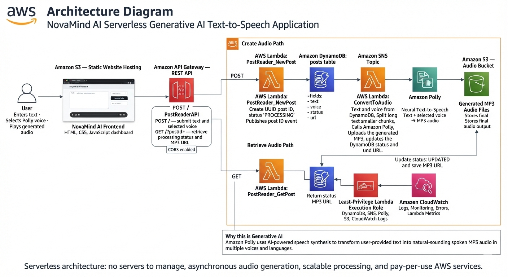
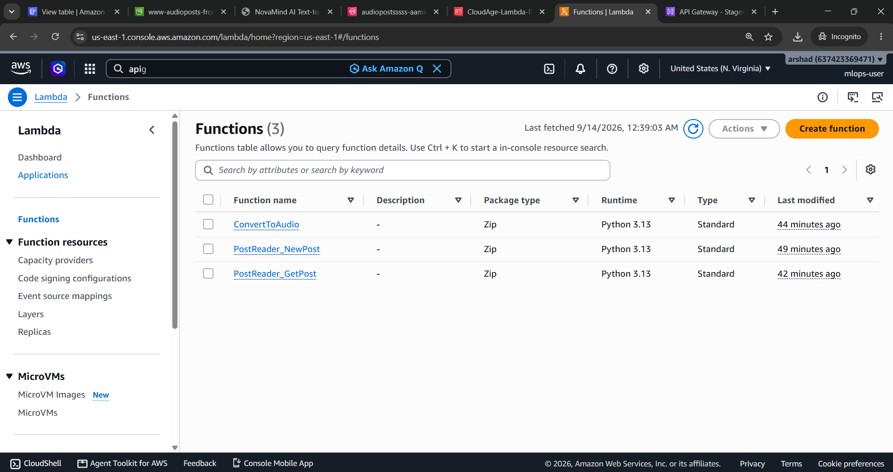
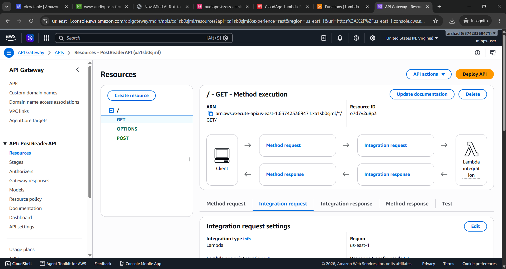
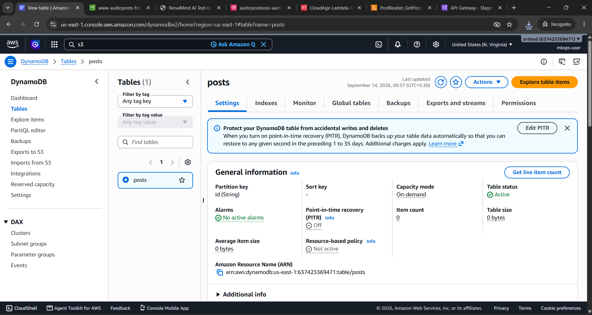
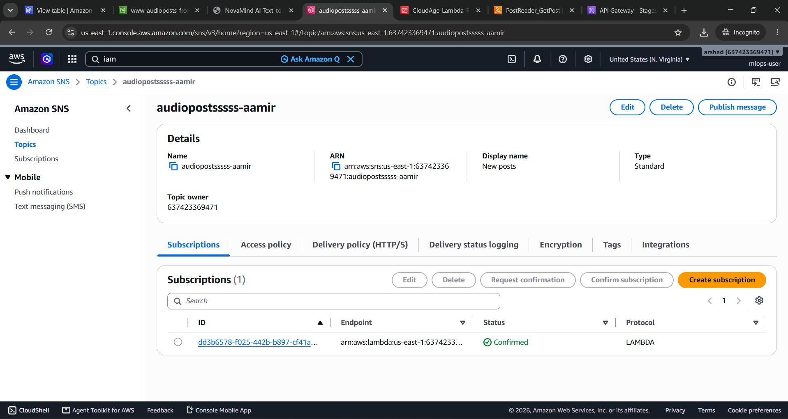
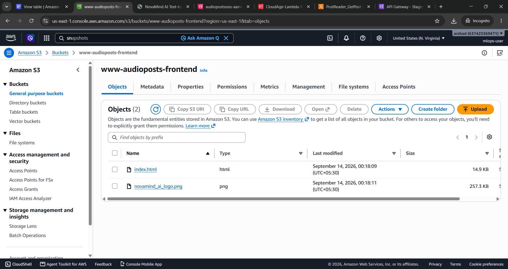

# 🎙️ NovaMind AI — Text-to-Speech Converter
### Powered by Amazon Polly | Built on AWS Serverless Architecture

> Convert any text into natural-sounding MP3 audio using Amazon Polly, delivered through a fully serverless AWS backend and a clean web frontend hosted on S3.

🔗 **Live App:** http://audiopostssss.s3-website-us-east-1.amazonaws.com/

Built by **Aamir** | [LinkedIn](https://www.linkedin.com/in/aamir-imran)

---

## 🖥️ Application Screenshots

### Dashboard — Main Interface


### Submit Text & Generate Audio


### Audio Player — Playback Result


---

## 📌 Project Overview

**NovaMind AI** is a production-ready, production-grade Serverless Generative AI Text-to-Speech (TTS) Web Application. It leverages Amazon Web Services (AWS) managed services to convert user-submitted text into highly natural, human-like audio files in real time.

Because the backend is entirely serverless, it requires zero server management, automatically scales from zero to millions of requests, and charges strictly on a pay-per-use basis.

---

## 🏗️ Architecture



```
Browser (S3 Static Website)
        │
        ▼
   API Gateway (REST API)
   ┌────────────────────┐
   │  POST /  →  GET /  │
   └────────────────────┘
        │                 │
        ▼                 ▼
Lambda: NewPost     Lambda: GetPost
        │                 │
        ▼                 ▼
    DynamoDB ◄──────── DynamoDB
    (posts)            (posts)
        │
        ▼
    SNS Topic
        │
        ▼
Lambda: ConvertToAudio
        │
        ▼
  Amazon Polly
        │
        ▼
    S3 Bucket
   (MP3 files)
```

---

## 🛠️ Core Technology Stack

| Layer | Technology |
|---|---|
| **Frontend** | HTML5, CSS3, JavaScript — hosted as static site on Amazon S3 |
| **API Management** | Amazon API Gateway — HTTP REST API with CORS enabled |
| **Compute** | AWS Lambda — serverless microservice business logic |
| **Database** | Amazon DynamoDB — NoSQL key-value store for state tracking |
| **Event Orchestration** | Amazon SNS — decoupled asynchronous execution flow |
| **Generative AI Engine** | Amazon Polly — neural text-to-speech synthesis |
| **Storage** | Amazon S3 — stores final generated `.mp3` audio outputs |
| **Security & Monitoring** | AWS IAM (fine-grained roles) + Amazon CloudWatch (logging & metrics) |

---

## 🔄 Step-by-Step Architecture Flow

The system operates using two distinct paths: the **Write Path** (Audio Creation) and the **Read Path** (Audio Retrieval).

### 1. The Frontend Dashboard
A user visits the NovaMind AI website, enters custom text, picks a neural voice profile (language, accent, gender), and hits **"Generate Audio"**.

### 2. The Create Audio Path — Asynchronous Write Pipeline

1. **API Submission** — Browser sends a `POST /` request with the text payload to PostReaderAPI (API Gateway)
2. **Request Intake (PostReader_NewPost)** — Lambda generates a UUID, initializes status as `PROCESSING`, saves metadata to DynamoDB `posts` table
3. **Event Broadcast** — Lambda publishes the new post event to an SNS Topic, decoupling the client response from heavy audio compilation and immediately freeing the API for new traffic
4. **Audio Synthesis (ConvertToAudio)** — SNS triggers a second worker Lambda which reads the text, breaks it into chunks if long, passes it to Amazon Polly, receives MP3 streams, assembles them, and uploads to S3 Audio Bucket
5. **State Update** — DynamoDB record updated: status → `UPDATED`, url → public S3 object URL

### 3. The Retrieve Audio Path — Synchronous Read Pipeline

1. Client fires a `GET /?postId=` request to API Gateway
2. `PostReader_GetPost` Lambda checks the status in DynamoDB
3. If `PROCESSING` → UI shows a loader. Once `UPDATED` → returns the MP3 URL
4. Browser's native media player streams the audio file directly from S3

---

## 🧠 Why This Qualifies as Generative AI

Instead of relying on pre-recorded audio files or robotic phoneme splicing, **Amazon Polly** uses deep learning models to synthesize human-like speech. It dynamically generates entirely new audio content from raw text, adjusting for contextual nuances, punctuation pacing, accents, and inflection to simulate a natural human speaker.

---

## ☁️ AWS Services Used

| Service | Purpose |
|---|---|
| **Amazon Polly** | Generative AI — neural text-to-speech synthesis |
| **AWS Lambda** | Serverless compute (3 microservice functions) |
| **Amazon DynamoDB** | NoSQL state tracking — post metadata and audio URLs |
| **Amazon SNS** | Async event orchestration between Lambda functions |
| **Amazon S3** | Audio file storage + static frontend hosting |
| **API Gateway** | REST API — POST (create) and GET (retrieve) endpoints |
| **AWS IAM** | Fine-grained execution roles, least-privilege security |
| **Amazon CloudWatch** | Logging, error tracking, and Lambda metrics |

---

## 📸 AWS Console Screenshots

### Lambda Functions (3 Functions)


### API Gateway Configuration


### DynamoDB Table


### SNS Topic


### Frontend S3 Bucket


---

## ⚙️ Lambda Functions

### 1. `PostReader_NewPost`
- Triggered by: API Gateway `POST /`
- Accepts `{ "voice": "Joanna", "text": "Hello world" }`
- Creates a DynamoDB record with status `PROCESSING`
- Publishes the record ID to SNS topic
- Returns the unique post ID

### 2. `ConvertToAudio`
- Triggered by: SNS topic
- Reads the post from DynamoDB
- Splits long text into ~2500-char blocks (Polly limit)
- Calls Amazon Polly to synthesize MP3
- Uploads MP3 to S3 with `public-read` ACL
- Updates DynamoDB record: status → `UPDATED`, url → S3 URL

### 3. `PostReader_GetPost`
- Triggered by: API Gateway `GET /?postId=`
- Accepts `postId` — use `*` to retrieve all posts
- Queries DynamoDB and returns item(s)

---

## 🗄️ DynamoDB Schema

**Table name:** `posts`  
**Partition key:** `id` (String)

| Attribute | Type | Description |
|---|---|---|
| `id` | String | UUID — unique post identifier |
| `text` | String | Input text submitted by user |
| `voice` | String | Polly voice (e.g. `Joanna`) |
| `status` | String | `PROCESSING` or `UPDATED` |
| `url` | String | Public S3 URL of the MP3 file |

---

## 🌐 Frontend Features

- Select from 15 Amazon Polly voices across 10+ languages
- Submit text and receive a post ID instantly
- Search by post ID (or `*` for all posts)
- Built-in HTML5 audio player for each generated clip
- Character counter on text input
- Responsive design — works on mobile and desktop
- API endpoint pre-configured — works instantly on open

---

## 📁 Project Structure

```
PollyGenAI/
├── API_GW/
│   └── PostReaderAPI-prod-swagger-apigateway.json   # Exported API spec
├── ConvertToAudio/
│   └── lambda_function.py                           # Lambda 2: Polly → S3
├── get_audio_post/
│   └── lambda_function.py                           # Lambda 3: Read DynamoDB
├── Load_On_S3_or_ELB/
│   ├── index.html                                   # Frontend web app
│   └── mylogoo.png                                  # NovaMind AI logo
├── PostReader_NewPost/
│   └── PostReader_NewPost.py                        # Lambda 1: Create post
├── project-pic/                                     # Screenshots
│   ├── architecture.jpg                             # Full architecture diagram
│   ├── NovaMind Ai Text to Speech Dashboard1.png
│   ├── NovaMind Ai Text to Speech Dashboard2.png
│   ├── NovaMind Ai Text to Speech Dashboard3.png
│   ├── aws-3-lambda-functions.png
│   ├── aws-api-gateway.png
│   ├── aws-dynamodb.png
│   ├── aws-sns.png
│   └── aws-fronted-s3-bucket.png
├── ReadersAreTheLeaders/
│   ├── Serverless Text-to-Speech...txt              # Original step guide
│   └── awsCLI.rtf                                   # AWS CLI cleanup commands
├── README.md                                        # This file
├── interview.md                                     # Interview preparation guide
├── github.txt                                       # Git commands reference
└── steps_to_do.md                                   # Full deployment guide
```

---

## 🚀 Deployment Summary

> Full step-by-step instructions are in [`steps_to_do.md`](./steps_to_do.md)

1. Create DynamoDB table `posts` (partition key: `id`)
2. Create S3 bucket for audio files (ACLs enabled, public access on)
3. Create SNS Standard topic
4. Create IAM role with Polly, DynamoDB, SNS, S3, CloudWatch permissions
5. Deploy Lambda 1: `PostReader_NewPost` — set env vars `SNS_TOPIC` + `DB_TABLE_NAME`
6. Deploy Lambda 2: `ConvertToAudio` — set env vars `DB_TABLE_NAME` + `BUCKET_NAME`, add SNS trigger
7. Deploy Lambda 3: `PostReader_GetPost` — set env var `DB_TABLE_NAME`
8. Create API Gateway REST API with POST and GET methods + CORS + mapping template
9. Create frontend S3 bucket with static website hosting + bucket policy
10. Upload `index.html` + `mylogoo.png` → test the live app

---

## 🔐 IAM Permissions Required

The Lambda execution role needs:
- `polly:SynthesizeSpeech`
- `dynamodb:Query`, `Scan`, `PutItem`, `UpdateItem`
- `sns:Publish`
- `s3:PutObject`, `PutObjectAcl`, `GetBucketLocation`
- `logs:CreateLogGroup`, `CreateLogStream`, `PutLogEvents`

---

## 🧪 Testing

**Test Lambda 1 (create post):**
```json
{
  "voice": "Joanna",
  "text": "Hello, this is NovaMind AI speaking."
}
```

**Test Lambda 3 (get all posts):**
```json
{
  "postId": "*"
}
```

**Test via API Gateway:**
```bash
# Create a new post
curl -X POST https://<api-id>.execute-api.us-east-1.amazonaws.com/prod \
  -H "Content-Type: application/json" \
  -d '{"voice":"Joanna","text":"Hello from NovaMind AI"}'

# Retrieve all posts
curl "https://<api-id>.execute-api.us-east-1.amazonaws.com/prod?postId=*"
```

---

## 🧹 Cleanup

```bash
# Empty and delete the audio bucket
aws s3 rb s3://audiopostssss-aamir --force

# Empty and delete the frontend bucket
aws s3 rb s3://www-audioposts-frontend --force
```

Also delete manually: Lambda functions, DynamoDB table, SNS topic, API Gateway, IAM role.

---

## 👤 Author

**Aamir**  
Cloud & AI Engineer  
🔗 [linkedin.com/in/aamir-imran](https://www.linkedin.com/in/aamir-imran)

---

## 📄 License

This project is for educational and portfolio purposes.
